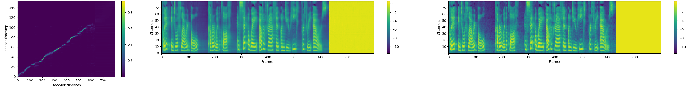

# Tacotron 2 (without wavenet)

PyTorch implementation of [Natural TTS Synthesis By Conditioning
Wavenet On Mel Spectrogram Predictions](https://arxiv.org/pdf/1712.05884.pdf) by NVIDIA.
Original repository can be found [here](https://github.com/NVIDIA/tacotron2).

Alignment, predicted mel spectrogram, target mel spectrogram:

## Pre-requisites
1. NVIDIA GPU + CUDA cuDNN

## Setup
1. Initialize waveglow submodule: `git submodule update --init`
2. Install conda environment
   1. `sudo apt install libsndfile1 ffmpeg`
   2. `conda install -c conda-forge nvidia-apex`
   3. `conda env create -f env.yml`

## Training
1. Specify the speech corpus directory path in `hparams.py` field `data_dir`. Note that by default, the hyperparameters are set to support 22050 sample rate audio datasets. You will need to modify the hyperparameters if your speech corpus audio sample rate is different.
2. `python train.py --output_directory=outdir --log_directory=logdir`
3. (OPTIONAL) `tensorboard --logdir=outdir/logdir`

## Training using a pre-trained model
Training using a pre-trained model can lead to faster convergence  
By default, the dataset dependent text embedding layers are [ignored]

1. Download a [Tacotron 2] model published by Nvidia
2. `python train.py --output_directory=outdir --log_directory=logdir -c tacotron2_statedict.pt --warm_start`

## Multi-GPU (distributed) and Automatic Mixed Precision Training
1. `python -m multiproc train.py --output_directory=outdir --log_directory=logdir --hparams=distributed_run=True,fp16_run=True`

## Inference demo
1. Download a [Tacotron 2] model published by NVIDIA
2. Download a [WaveGlow] model published by NVIDIA
3. `jupyter notebook --ip=127.0.0.1 --port=31337`
4. Load inference.ipynb 

N.b.  When performing Mel-Spectrogram to Audio synthesis, make sure Tacotron 2
and the Mel decoder were trained on the same mel-spectrogram representation.

[WaveGlow]: https://drive.google.com/open?id=1rpK8CzAAirq9sWZhe9nlfvxMF1dRgFbF
[Tacotron 2]: https://drive.google.com/file/d/1c5ZTuT7J08wLUoVZ2KkUs_VdZuJ86ZqA/view?usp=sharing
[ignored]: https://github.com/NVIDIA/tacotron2/blob/master/hparams.py#L22
